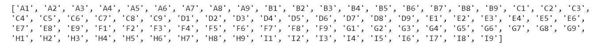
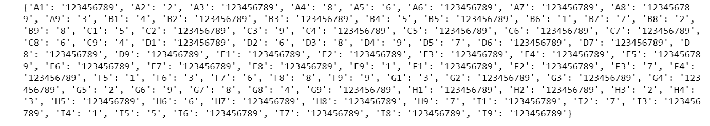
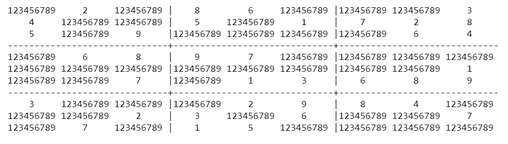
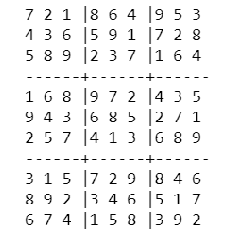
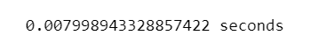

# SUDOKU SOLVER

## AIM:

To develop a python program to solve a given sudoku puzzle.

## THEORY:

One algorithm to solve Sudoku puzzles is the backtracking algorithm. Essentially, you keep trying numbers in empty spots until there aren't any that are possible, then you backtrack and try different numbers in the previous slots. “Scan rows and columns within each triple-box area, eliminating numbers or squares and finding situations where only a single number can fit into a single square.”

## DESIGN STEPS:

### Step 1:
Import required packages.Define the Linear Programming problem.

### Step 2:
Set the objective function and grid structure.

### Step 3:
Define the decision variables.

### Step 4:
Set the constraints or set of rules.

### Step 5:
Solve the Sudoku puzzle using specific functions like elimination and only choice and further to solve complex problems we has to define reduced puzzles .

### Step 6:
Check if an optimal result is found.

## PROGRAM:

/*
Name: Paarkavy B

Reg. No: 212221230072
*/

```
%matplotlib inline
import random
import matplotlib.pyplot as plt
import math
import sys
import time
```

```
rows='ABCDEFGHI'
cols='123456789'
def cross(a,b):
    return[s+t for s in a for t in b]
```

```
boxes=cross(rows,cols)
print(boxes)
```

```
row_units=[cross(r,cols) for r in rows]
column_units=[cross(rows,c) for c in cols]
square_units=[cross(rs,cs) for rs in ('ABC','DEF','GHI') for cs in ('123','456','789')]
unitlist=row_units+column_units+square_units
units=dict((s, [u for u in unitlist if s in u ])for s in boxes)
peers=dict((s, set(sum(units[s],[]))-set([s])) for s in boxes)
```

```
def grid_values_improved(grid):
    values=[]
    all_digits='123456789'
    for c in grid:
        if c =='.':
            values.append(all_digits)
        elif c in all_digits:
            values.append(c)
    assert len(values) == 81
    return dict(zip(boxes, values))
```

```
puzzle_dict_improved=grid_values_improved(puzzle)
print(puzzle_dict_improved)
```

```
def display(values):
    width = 1+max(len(values[s]) for s in boxes)
    line='+'.join(['-'*(width*3)]*3)
    for r in rows:
        print(''.join(values[r+c].center(width)+('|' if c in '36' else '')
              for c in cols))
        if r in 'CF': print(line)
    return
display(puzzle_dict_improved)
```

```
def display(values):
    width = 1+max(len(values[s]) for s in boxes)
    line='+'.join(['-'*(width*3)]*3)
    for r in rows:
        print(''.join(values[r+c].center(width)+('|' if c in '36' else '')
              for c in cols))
        if r in 'CF': print(line)
    return
display(puzzle_dict_improved)
```

```
def eliminate(values):
    solved_values=[box for box in values.keys() if len(values[box]) == 1]
    for box in solved_values:
        digit = values[box] 
        for peer in peers[box]:
            values[peer] = values[peer].replace(digit,'')
    return values
```

```
def only_choice(values):
    for unit in unitlist: 
        for digit in '123456789':
            dplaces=[box for box in unit if digit in values[box]]
            if len(dplaces) == 1:
                values[dplaces[0]] = digit
    return values
```

```
def reduced_puzzle(values):
    stalled = False
    while not stalled:
        solved_values_before = len([box for box in values.keys() if len(values[box]) == 1])
        eliminate(values)
        only_choice(values)
        solved_values_after = len([box for box in values.keys() if len(values[box]) == 1])
        stalled = solved_values_before == solved_values_after
        if len([box for box in values.keys() if len(values[box]) == 0]):
            return False
    return values
```

```
def search(values):
    values_reduced=reduced_puzzle(values)
    if not values_reduced:
        return False
    else:
        values=values_reduced
    if len([b1 for b1 in boxes if len(values[b1])==1])==81:
        return values
    possibility_count_list=[(len(values[b1]),b1) for b1 in boxes if len(values[b1])>1]
    possibility_count_list.sort()
    for (_,t_box_min) in possibility_count_list:
        for i_digit in values[t_box_min]:
            new_values=values.copy()
            new_values[t_box_min]=i_digit
            new_values=search(new_values)
            if new_values:
                return new_values
    return False
```

```
def solve(grid):
    values = grid_values_improved(grid)
    return search(values)
```

```
if __name__ == '__main__':
    puzzle='.2.86...34..5.17285.9....64.6897............1..7.136893...2984...23.6..7.7.15....'
    start_time = time.time()
    display(solve(puzzle))
    time_taken=time.time() - start_time
    print("\n\n{0} seconds".format(time_taken))
result=search(puzzle_dict_improved)
```

```
if result:
    display(result)
else:
    print("Failed!!!")
```

## INPUT:

### UNSOLVED PUZZLE:


## OUTPUT:

### LABEL OF EACH BOXES:



### POSSIBLE VALUES IN EMPTY BOXES:



### POSSIBLE VALUES REPRESENT IN GRID:



### SOLVED PUZZLE:



### TIME TAKEN TO SOLVE:



### RESULT:

Hence a python program has been developed to solve a given sudoku puzzle.